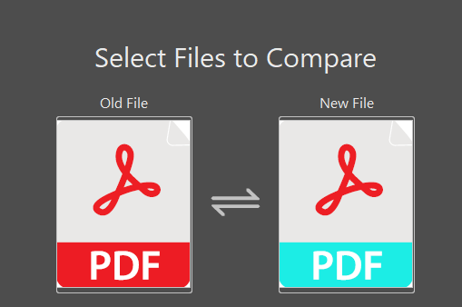

# About

Tired of recoloring pdf assets? This prototype will help!

<p align="center">
  
</p>

# How to use

1. Install `requirements.txt`.
    ```bash
    pip install -r requirements.txt
    ```

2. Setup color config

    ```json
    {
        "replacements": [
            {
                "color": {
                    "old": "#ed1c24",
                    "new": "#1cede5"
                }
            }
        ]
    }
    ```

3. Run tool on one file or directory

    ```bash
    usage: recolor.py [-h] --config-path CONFIG_PATH
                    [--output-path OUTPUT_PATH] [--verbose]
                    target_path

    Replace colors in PDF files

    positional arguments:
    target_path           Path to file or directory to modify.

    options:
    -h, --help            show this help message and exit
    --config-path CONFIG_PATH
                            Path to config with color mapping.
    --output-path OUTPUT_PATH
                            Alternative path to directory or file to save
                            result.
    --verbose             Debug mode
    ```


# Todo

1. Support colors with opacity.
2. Support gradients.
3. Add ability to recolor without config.
4. Improve performance